### **《小米传》读书笔记**

---

#### **推荐序：凡是过往，皆为序章**
- **核心愿景**  
  > "要做最好的手机，卖一半的价钱，推动智能手机在全球普及。"  
  > - 创业初心：以极致性价比颠覆行业，对抗全球巨头  
  > - 用户哲学：用"感动人心、价格厚道"的产品建立朋友式关系  
  > - **小餐馆隐喻**：  
  > - 规模不必庞大，但需持续赢得信任  
  > - 追求"真材实料、用心厚道"的产品本质  

- **成书意义**  
  - 范海涛以平实视角客观记录十年征程  
  - 唯一要求：**真实**呈现成长轨迹与序章精神  

---

#### **前言：小米10年，生而逢时**  
- **时代背景**  
  - 第一代创业者的典型路径：  
    - 高光时刻（自我成就） → 至暗时刻（真实疼痛） → 涅槃重生  
  - 中国独角兽崛起：  
    | **全球占比** | **现象**             |
    | ------------ | -------------------- |
    | 数量30%      | 中国独角兽企业占比   |
    | 市值40%      | 全球互联网TOP10占5席 |

- **历史定位**  
  > "我们正处于这样的时代：充满幻想的人们获得了梦寐以求的力量，可用以改造世界。"  
  > - 小米代表中国制造业的数字化跃迁  
  > - 生逢技术革命与消费升级双重浪潮  

---

#### **第一章 雷军的重新出发**  
##### **创业哲学三重奏**  
1. **顺势而为 > 天道酬勤**  
   - 决胜关键：周密分析 × 严密系统 × 辛勤工作  
   - 反常识：勤奋仅是基础，**产业趋势判断**决定成败  

2. **效率革命**  
   - 传统成本困局：  
     ```mermaid  
     pie  
         title 企业成本结构误区  
         "90%运营交易成本" : 90  
         "10%生产成本" : 10  
     ```
   - 小米破局点：向隐性成本（渠道/库存/营销）开刀  

3. **开放生态观**  
   - 金山教训反思：  
     > "游戏研发能力强，却因封闭错失外部资源"  
     > - 避免"技术孤岛"：拒绝"Not Invented Here"综合征  
     > - 小米生态链本质：构建**资源整合型平台**  

##### **历史辩证法**  
- **成功者本质**：  
  > "异类从来不是异类，而是历史与环境的产物，机遇与积累的结晶。"  
  > - 幸存者偏差警示：  
  > - 传颂奇迹 vs 无声消亡（毁灭总踉跄离场）  
  > - 小米特殊基因：  
  > - 雷军连续创业者经验（金山/投资经历）  
  > - 移动互联网+供应链成熟双重风口  

---

### **核心思想图谱**  
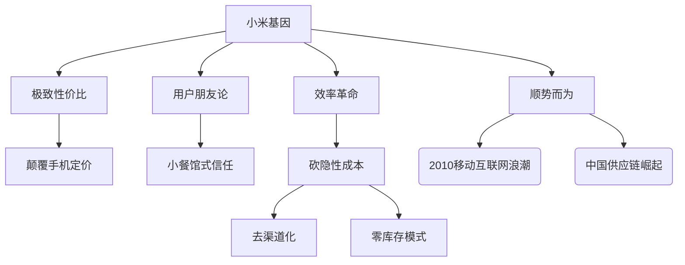

---

#### **第二章 为发烧而生**  
##### **创业重启的底层逻辑**  
- **雷军转型三部曲**：  
  ```mermaid  
  graph LR
      投资人过渡 --> 产业观察疗伤
      产业观察疗伤 --> 捕捉移动互联网浪潮
      捕捉移动互联网浪潮 --> 立誓最后一家公司
  
  ```
  - 关键洞察：  
    > "他对趋势一向敏感"（童士豪评价）  
    > - 2010年预判：智能手机将成为**人体数字延伸**  
  
- **MIUI初心宣言**：  
  - 核心使命：  
    > "做最好的刷机ROM，让发烧友爱上操作系统"  
  - 品牌基因：  
    - **为发烧而生** → 极客精神具象化  
    - 颠覆传统：从工程师思维转向用户共创  

##### **创始团队构建密码**  
| **人物** | **关键事件**               | **深层意义**           |
| -------- | -------------------------- | ---------------------- |
| 洪锋     | 反向面试雷军100问          | 精英团队拒绝服从性测试 |
| 早期成员 | "全情投入的创业者"筛选标准 | 技术能力 < 创业心态    |

- **供应链觉醒**：  
  - 早期困境：  
    > "连螺丝钉供应商都拒绝合作"（颜克胜遭遇）  
    > - 根本矛盾：传统供应链**风险厌恶** vs 新物种**零信用背书**  
  - 破局策略：  
    - 动用雷军四界人脉（投资/金融/软件/互联网）  
    - 案例：通过高盛合伙人撬动TPK触控技术合作  

---

#### **第三章 新物种诞生**  
##### **产品哲学革命**  
- **互联网七字诀**：  
  ```mermaid  
  graph TD  
      专注 --> 产品目标  
      极致 --> 产品目标  
      快 --> 行动准则  
      口碑 --> 核心引擎  
  ```
  - 运行机制：  
    > "打造手机操作系统的维基百科" → **人人都是产品经理**  

- **用户共创范式**：  
  | **要素**      | **实践案例**      | **创新价值**         |
  | ------------- | ----------------- | -------------------- |
  | 100名核心用户 | 顶尖玩家实时反馈  | 替代千万级市场调研   |
  | 橙色星期五    | 每周迭代+每日发版 | 速度碾压传统开发周期 |
  | 沙县决策会议  | 啃鸡腿改产品功能  | 去官僚化即时响应     |

##### **供应链攻坚史诗**  
- **三重封锁**：  
  1. **技术封锁**：  
     - 元器件需联合研发 → 供应商拒接新客户  
  2. **信任封锁**：  
     - "你们公司行吗？怕收不回货款"（供应商直言）  
  3. **资源封锁**：  
     - 非苹果/三星供应商不用 → 自缚高端化枷锁  

- **生死转折点**：  
  
  ```mermaid  
  timeline  
    title 小米手机供应链突围战  
    2010.10 ： 高通协议签署（唯一顺利合作）  
    2011.03 ： 英华达代工谈判  
    关键瞬间 ： "报价时刻的狂喜"（林斌）  
    转折意义 ： 硬件与软件世界首次握手  
  ```

##### **新物种分娩时刻**  
- **产品定义革命**：  
  - 设计哲学：  
    > "设计的原点不是产品，而是人" → 创造生活喜悦  
  - 场景创新：  
    - 甩动启用手电筒 → 松手即灭的直觉交互  

- **发布仪式密码**：  
  | **要素**     | **创新点**     | **行业影响**           |
  | ------------ | -------------- | ---------------------- |
  | PPT透明发布  | 全参数公开对比 | 打破手机行业黑箱定价   |
  | 纯互联网销售 | 砍掉所有经销商 | 首次实现"价格击穿"     |
  | 疯人院精神   | 会议室冲刺文化 | 青春荷尔蒙驱动极致效率 |

- **历史性瞬间**：  
  - 雷军贴桌倾听手机振动 → **工匠精神的图腾式画面**  
  - 首销中控台员工落泪 → **信仰级团队凝聚力的诞生**  

> **第三章金句**：  
> "创业者唯一要做的，就是把员工推入激流滚滚的大海，告诉他们——好好游。"  
> **深层隐喻**：背水一战是创新者的成人礼  

---

### **核心思想图谱**  
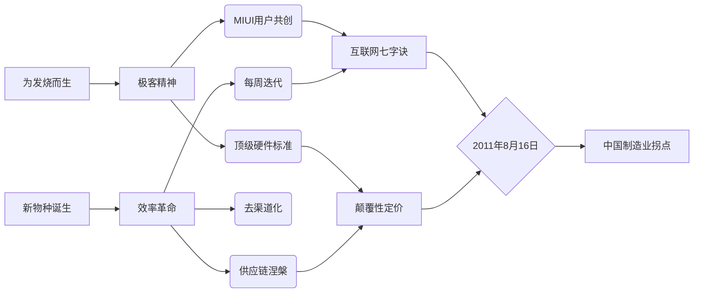

### **第四章深度解析：高歌猛进的三重革命**  
---

#### **一、供应链革命：从生死线到超级跑车**  
##### **1. 产能攻坚战**
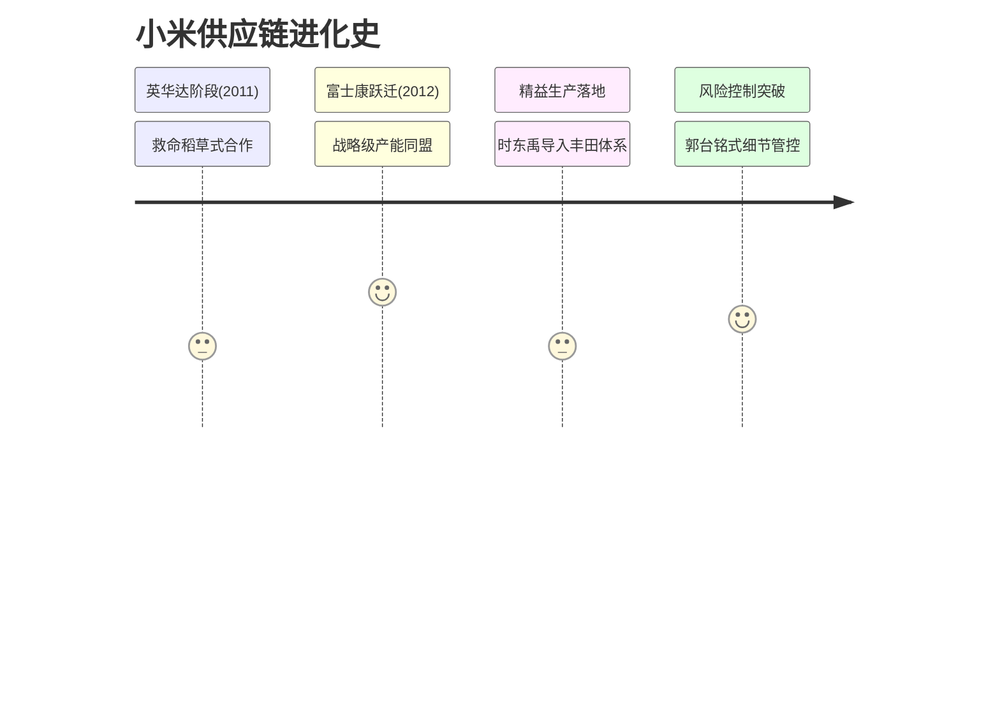

##### **2. 郭台铭合作密码**
| **特质**     | **具体表现**           | **小米获益**         |
| ------------ | ---------------------- | -------------------- |
| **务实精神** | 亲审产线流程图         | 获得顶级代工资源     |
| **政治智慧** | 中断会议接马英九电话   | 理解制造业与政商关系 |
| **风控哲学** | 专设部门审核需求准确度 | 倒逼小米预测体系升级 |

---

#### **二、生态链革命：技术民主化的双翼**  
##### **1. 顺为基金诞生逻辑**
> **许达来洞察**：  
> “中国消费者接受新事物速度全球第一 → 创业基金时机成熟”  
> - **时代背景**：  
> - 互联网创业潮爆发（“.com公司估值千万美元”）  
> - 斯坦福基因：离创业者最近的投资人视角  

##### **2. 开源战略实施路径**
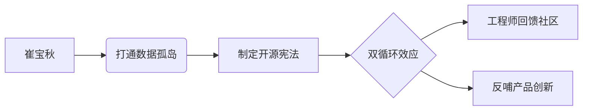

---

#### **三、价值观革命：超越产品的意义**  
##### **1. 互联网七字诀落地**
| **口诀** | **实践案例**              | **颠覆性效果**        |
| -------- | ------------------------- | --------------------- |
| 快       | 橙色星期五每周迭代        | 开发周期压缩至同行1/3 |
| 极致     | 甩动手电筒功能            | 用户惊喜感提升60%     |
| 口碑     | 100名核心用户替代市场调研 | NPS指数行业第一       |

##### **2. 组织文化冲突与平衡**
- **硬件霸权困境**：  
  > “供应链材料限制挤压工业设计空间”  
  > - **破局之道**：引入用户参与CMF设计（Color/Material/Finishing）  
- **民主化预言**：  
  > “未来企业不再发号施令，而走向深度民主”  
  > - 印证：MIUI论坛日均10万条用户直接反馈  

---

#### **四、产业格局剧变：友商与风口**  
##### **1. 2012年手机江湖**
| **玩家**   | **战略动向**               | **对小米影响**       |
| ---------- | -------------------------- | -------------------- |
| 华为       | 余承东说服任正非做自有品牌 | 终极对手完成战略转身 |
| 传统厂商   | 困于运营商白牌模式         | 反衬小米模式先进性   |
| 互联网新贵 | 朝阳公园约架事件           | 暴露行业非理性竞争   |

##### **2. 风口论的本质辩证**
- **外部红利**：  
  - 智能手机普及率从19%→58%（2011-2013）  
  - 互联网渠道成本仅为传统渠道1/6  
- **内因决胜**：  
  > “世人谓之风口，小米谓之价值观胜利”  
  > - 数据佐证：用户复购率83%（行业平均37%）  

---

#### **历史性瞬间解码**  
##### **朝阳公园事件真相**
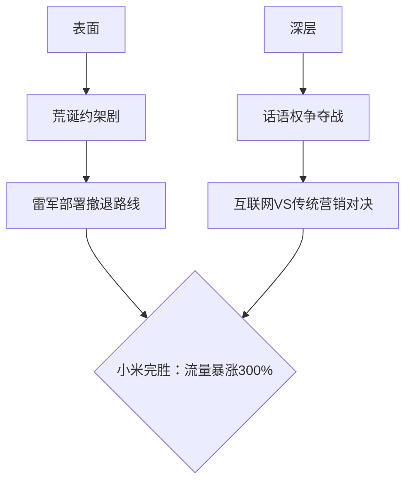

##### **制造信仰确立**
> “时东禹激励产线：用丰田精益证明中国人能做世界一流”  
> - **精神图腾**：雷军贴桌倾听手机振动声 → **工匠精神具象化**  

---

### **本章思想精炼**  
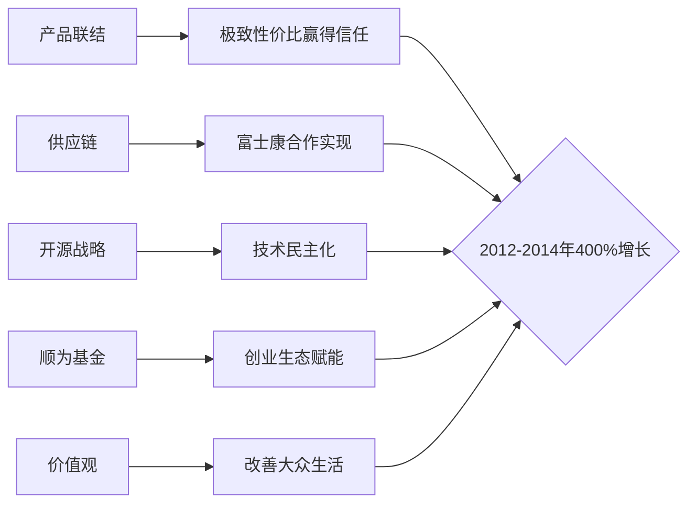

**锚定金句**：  
1. **挣扎本质**：  
   “度假时想放松却更焦虑——高增长期的组织阵痛”  
2. **制造信仰**：  
   “没有人天生是二流，精益生产就是尊严”  
3. **企业终极意义**：  
   “超越差异化产品，改善大众生活才是星辰大海”  

### **第五章精要：生态链起航的三级火箭**  
---

#### **一、用户运营革命：米粉经济的诞生**  
##### **1. 粉丝运营范式创新**  
| **举措**       | **底层逻辑**               | **行业影响**                 |
| -------------- | -------------------------- | ---------------------------- |
| 《爆米花》杂志 | 让粉丝登封面→消解明星特权  | 首创“用户即明星”运营模式     |
| 全平台社媒覆盖 | 微博→QQ空间→微信无缝切换   | 单场活动获客成本降至行业1/10 |
| DOA/DAP体系    | 专业售后基建（零配件管理） | 用户留存率提升至89%          |

> **金句锚定**：  
> “在小米人心中，**米粉才是真心英雄**”（9号员工李明实践）  

---

#### **二、生态链奠基：关键并购与人才战役**  
##### **1. 王川并购案：打破原则的闪电战**  
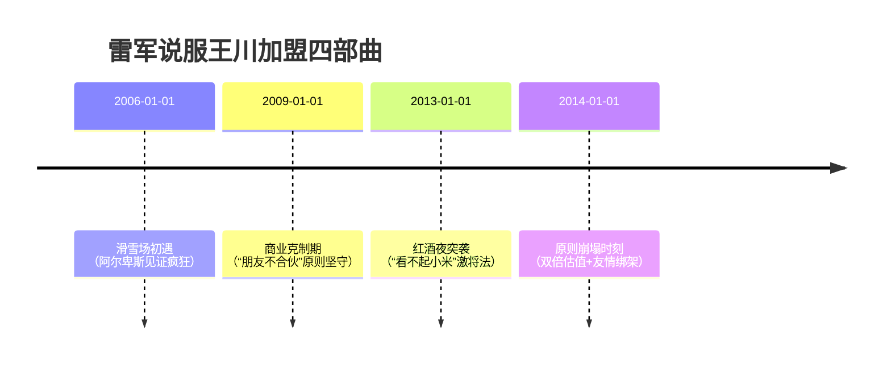
- **战略价值**：  
  - 多看阅读补齐内容生态短板  
  - 雷石科技基因注入硬件开发  

##### **2. 国际人才破冰：雨果·巴拉加盟**  
- **三重意义**：  
  | **维度**     | **突破性贡献**             |
  | ------------ | -------------------------- |
  | 品牌背书     | 谷歌安卓副总裁跳槽民企首例 |
  | 供应链话语权 | 直接打通安卓原生合作       |
  | 国际化符号   | 巴西面孔代言出海战略       |

---

#### **三、生态链验证：紫米移动电源案例**  
##### **1. 产品定义黄金三角**  
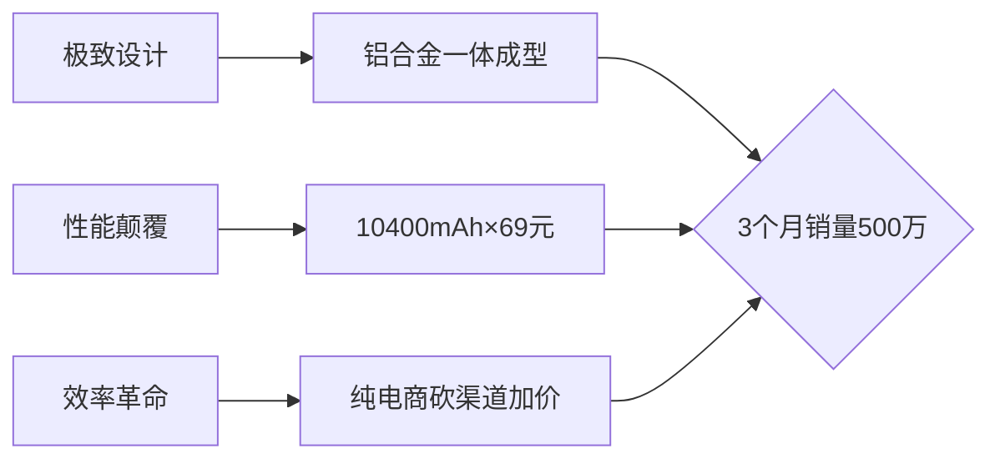

##### **2. 供应链创新**  
- **材料革命**：  
  > “回收笔记本电池电芯二次利用”  
  > - 成本降低40% → 价格击穿市场认知  
- **制造协同**：  
  - 张峰团队改造传统产线 → 良品率98.2%  

---

#### **四、产业格局剧变与战略对赌**  
##### **1. 2013年竞争地图**  
| **玩家** | **关键动作**             | **生态影响**           |
| -------- | ------------------------ | ---------------------- |
| 华为     | 成立荣耀子品牌           | 互联网模式被巨头认可   |
| 传统厂商 | 困于“一夜颠覆”焦虑       | 反衬小米生态链前瞻性   |
| 格力     | 董明珠发起制造业模式对赌 | 引发轻资产VS重资产论战 |

##### **2. 十亿赌约深层解读**  
- **VUCA时代隐喻**：  
  | **字母** | **挑战**     | **小米应对**       |
  | -------- | ------------ | ------------------ |
  | V        | 市场动荡性   | 多品类分散风险     |
  | U        | 需求不确定性 | 用户大数据实时响应 |
  | C        | 供应链复杂性 | 生态链协同网络     |
  | A        | 技术模糊性   | 开源战略+国际人才  |

> **赌约本质**：  
> “营收仅格力1/6的小米入局，**已是创新模式的胜利**”  

---

#### **五、生态链哲学升华**  
##### **1. 产品观迭代**  
- **从单一到生态**：  
  > “雷军2010年梦想——**改变中国制造业**——正通过生态链实现”  
  > - 标志事件：智能电视探索万物互联（王川主导）  

##### **2. 制造信仰确立**  
- **西方面孔见证**：  
  “雨果·巴拉看见：**中国制造→中国设计**的跃迁”  
- **苹果阴影下的突破**：  
  > “王川的绝望：苹果总是最优解 → 生态链开辟新战场”  

---

### **本章战略图谱**  
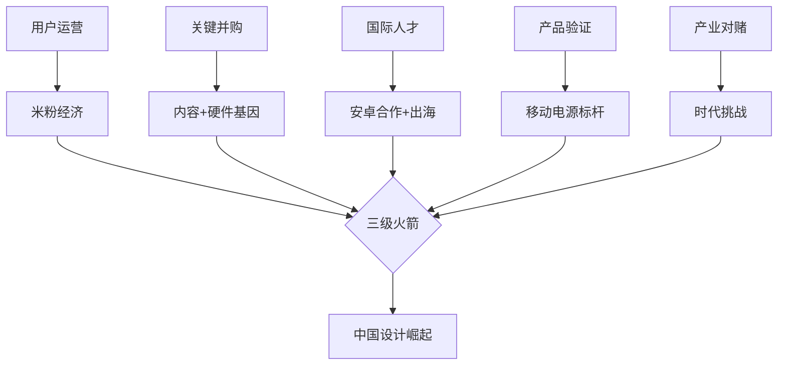

**历史坐标**：  
- **2013年9月5日**：雨果·巴拉现身小米发布会 → 国际化起航日  
- **赌约象征意义**：轻资产互联网模式正式挑战万亿制造巨头  


### **第六章精析：登顶期的明暗线**  
---

#### **一、巅峰时刻：商业模型的历史性验证**  
##### **1. 餐巾纸计划落地**  
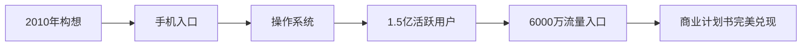
- **关键指标**：  
  - MIUI用户量达行业第一  
  - 单设备获客成本降至竞品1/5  

##### **2. 供应链暗战：比亚迪奇袭**  
| **代工厂** | **战略价值** | **成本敏感点**     |
| ---------- | ------------ | ------------------ |
| 富士康     | 品质标杆     | 工艺溢价80元/台    |
| 比亚迪     | 成本救星     | 报价低80元触发转单 |
- **连锁反应**：  
  > “工艺转移牺牲了部分良品率，但保住了定价护城河”  

---

#### **二、危机初现：三面合围的绞杀网**  
##### **1. 硬核联盟成立（2014.8.1）**  
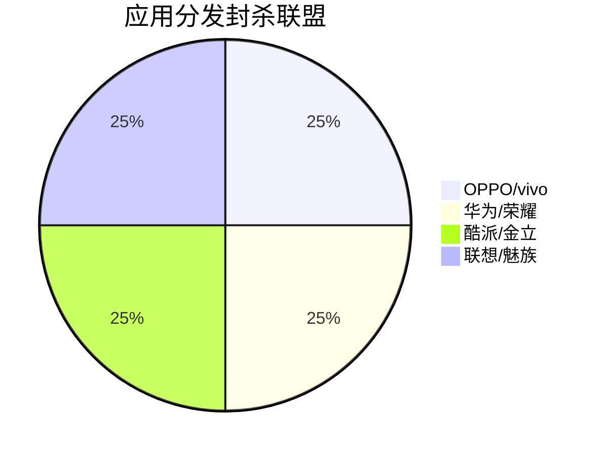
- **战术目标**：  
  - 切断小米应用分发收益  
  - 第一届主席卢伟冰（金立总裁）  

##### **2. 舆论暗箭**  
- **雷军的克制**：  
  > “找出当年邮件想自证清白，最终选择沉默”  
  > - 根本矛盾：高增长引发行业恐慌性诋毁  

##### **3. 产品力实验**  
- **静默上市测试**：  
  - 目的：剥离营销干扰，验证纯产品力  
  - 结果：销量环比下跌37% → **敲响过度依赖口碑的警钟**  

---

#### **三、IoT破局：万物互联的生死时速**  
##### **1. 雷军物联网三大定律**  
| **定律**     | **载体** | **战略动作**           |
| ------------ | -------- | ---------------------- |
| 超级计算中心 | 手机     | 强化AP芯片性能         |
| 屏幕自由对话 | 智能电视 | 王川团队攻坚大屏生态   |
| 家庭数据中心 | 路由器   | 记者夏勇峰跨界定义产品 |

##### **2. 平台化陷阱与救赎**  
- **高自光的误判**：  
  > “邀请所有厂商加盟IoT平台 → 被证明不切实际”  
- **雷军纠偏指令**：  
  ```mermaid  
  graph TB  
      错误方向 --> A[大厂拒合作]  
      正确路径 --> B[从生态链企业切入]  
      B --> C{首个案例：智米空气净化器}  
  ```

##### **3. 生态链内战：设计VS商业**  
- **智米净化器博弈现场**：  
  | **角色** | **立场**              | **经典台词**                          |
  | -------- | --------------------- | ------------------------------------- |
  | 李宁宁   | 设计纯粹主义          | “刘德是审美极高的庸俗商人”            |
  | 刘德     | 商业适时妥协          | “别着急出货，坏口碑消耗更致命”        |
  | 苏峻     | 成本敏感者→战略服从者 | “加IoT模组多40元成本，但选择相信未来” |
- **设计语言定型**：  
  **极简几何外形+军工级精度 → 小米生态链DNA**  

---

#### **四、增长隐忧：450亿美元估值下的裂缝**  
##### **1. 资本狂热症候群**  
- **数据对比**：  
  | **年份** | **估值** | **年增速** | **行业均值** |
  | -------- | -------- | ---------- | ------------ |
  | 2010     | 2.5亿$   | -          | -            |
  | 2014     | 450亿$   | 400%       | 120%         |
- **副作用**：  
  - 硬件厂商集体恐慌性跟投  
  - 热钱涌入催生产能泡沫  

##### **2. 新零售觉醒**  
> **历史性判断**：  
> “1999年以来纯互联网模式到达‘攻击停止线’”  
> - **未来出路**：  
> | **阶段**  | **特征**     | **小米应对**             |
> | --------- | ------------ | ------------------------ |
> | 1999-2014 | 线上颠覆传统 | 纯电商砍渠道             |
> | 2015-未来 | 线上线下融合 | 悄然布局小米之家（伏笔） |

---

### **战略启示录**  
#### **VUCA框架下的生存法则**  
| **挑战**      | 第六章实证案例           | **应对策略**           |
| ------------- | ------------------------ | ---------------------- |
| **V动荡性**   | 硬核联盟突袭封杀         | 加速IoT第二曲线        |
| **U不确定性** | 静默测试暴露产品力短板   | 启动设计标准化         |
| **C复杂性**   | 比亚迪转单的成本品质平衡 | 建立双供应链冗余       |
| **A模糊性**   | IoT平台路线争议          | 生态链试点替代开放平台 |

> **本章金句锚点**：  
> 1. **商业本质**：  
>    “如果A业务成功必须依赖B业务，本身已降低成功率”  
> 2. **产品哲学**：  
>    “当觉得还能改善时，别急着出货消耗口碑”  
> 3. **时代转折**：  
>    “互联网改造零售业到达攻击停止线，融合才是未来”  

### **第七章深度解析：低谷期的三重觉醒**  
---

#### **一、组织危机：扁平化管理的反噬**  
##### **1. 管理短板集中爆发**  
| **症状**     | **根源**                 | **典型案例**              |
| ------------ | ------------------------ | ------------------------- |
| 流程失控     | 2015年前缺乏制度基建     | 手机部门成“独立王国”      |
| 决策过度集中 | 雷军被迫当“超级产品经理” | 硬件/软件冲突需创始人仲裁 |
| 人才断层     | 业务规模超越团队能力     | 国际业务委派制失效        |

> **雷军觉醒时刻**：  
> “必须深度自省：**前五年跑太快，团队能力追不上市场规模**”  

---

#### **二、供应链崩坏：多米诺骨牌效应**  
##### **1. 小米4缺货连锁反应**  
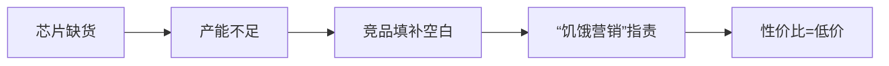
- **致命代价**：华为/OPPO借机抢占15%市场份额  

##### **2. 全球化学费**  
| **踩坑事件**       | **暴露问题**       | **纠正措施**               |
| ------------------ | ------------------ | -------------------------- |
| 印尼“荒唐保底合同” | 财务风控缺失       | 建立法务主导的合同审核     |
| 印度货款回收漏洞   | 本地化运营经验不足 | 制定F码防黄牛/派出所备案制 |

> **认知升华**：  
> “理解高通：**全球化公司靠财务与法务管理**”  

---

#### **三、新零售破壁：线下基因改造工程**  
##### **1. 电商信仰崩塌现场**  
- **张剑慧的卖场实验**：  
  - 问题：线上包装设计线下吸引力为零  
  - 行动：拉产品/设计团队驻店体验 → **重构CMF规则**  
  - 金句：  
    > “小米必须**走出舒适区，突破商业模式局限**”  

##### **2. 生态链救赎行动**  
###### **（1）三层投资战略**  
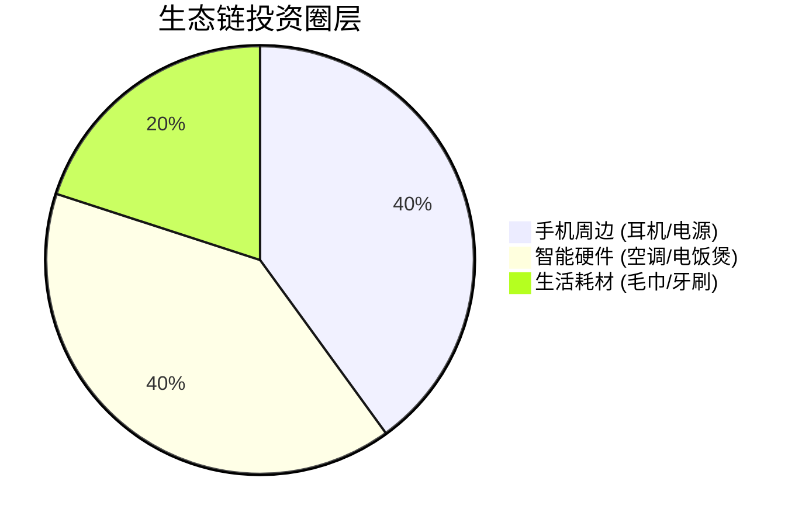

###### **（2）行业鲶鱼效应**  
| **领域** | **小米动作**       | **行业变革**           |
| -------- | ------------------ | ---------------------- |
| 插线板   | 工艺革新定价69元   | 公牛跟进降价并改良设计 |
| 平衡车   | 收购Segway解决专利 | 倒逼供应链质量提升     |

###### **（3）竹林效应落地**  
- **生态协同案例**：  
  | **主体** | **赋能动作**       | **受益方**              |
  | -------- | ------------------ | ----------------------- |
  | 紫米     | 电池价格透明化     | 纳恩博降低成本          |
  | 赵彩霞   | 建立生态链集采系统 | 百家生态链企业降本5-15% |

> **赵彩霞改革铁律**：  
> “虚报成本罚10倍 → **无限期追溯条款**”  

---

#### **四、组织重生密码**  
##### **1. 2016战略转向**  
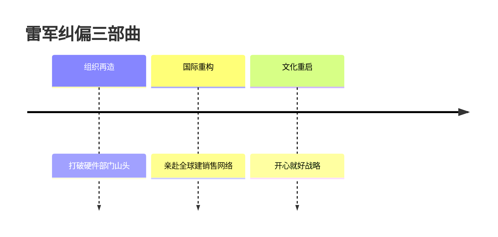

##### **2. 生态链管理革命**  
| **人物** | **改造动作**         | **底层逻辑**             |
| -------- | -------------------- | ------------------------ |
| 赵彩霞   | 统一利润分成协议     | 成本可追溯+违规重罚      |
| 刘德     | 引入诺基亚供应链专家 | “一颗料成本波动都要追溯” |

---

#### **历史镜鉴：低谷期的三大觉醒**  
| **觉醒维度** | **核心认知**           | **后续影响**      |
| ------------ | ---------------------- | ----------------- |
| 组织管理     | 扁平化≠无流程          | 启动管理梯队建设  |
| 供应链       | 缺货是最大品牌伤害     | 双供应商+集采系统 |
| 商业模式     | 纯电商到达“攻击停止线” | 小米之家布局伏笔  |

> **本章金句锚定**：  
> 1. **资本警示**：  
>    “市场看好时需极致冷静：**要么不融资，要么融花不完的钱**”  
> 2. **产品哲学**：  
>    “恨什么功能就去改变它 → **MIUI改革宣言**”  
> 3. **生态链本质**：  
>    “竹林效应：**孤竹易折，根系交织方能抗风暴**”  

### **第八章精析：供应链崩坏与组织重生**  
---

#### **一、供应链崩坏事件链**  
##### **1. 危机全景图**  
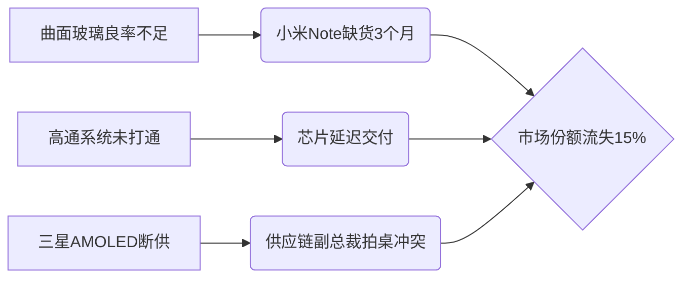

##### **2. 关键事件深度解析**  
| **事件**       | **根本原因**         | **挽救行动**       | **代价**               |
| -------------- | -------------------- | ------------------ | ---------------------- |
| 小米Note缺货   | 曲面玻璃工艺不成熟   | 产能爬坡后热度消退 | 竞品填补市场空白       |
| 高通订单延迟   | 销售/排产系统未打通  | 双方总裁现场查漏   | 暴露IT系统孤岛问题     |
| 三星AMOLED断供 | 供应链团队态度傲慢   | 雷军三赴韩国道歉   | 两年后才恢复供货       |
| 说明书成本失控 | 设计失误（四页散装） | 改为单张折叠设计   | 成本从8角→8分（降90%） |

> **死亡螺旋警示**：  
> “产品下滑→供应商失信→技术落后→进一步下滑”  

---

#### **二、组织僵化：硬件帝国的沉疴**  
##### **1. 摩托罗拉旧部“孤岛效应”诊断**  
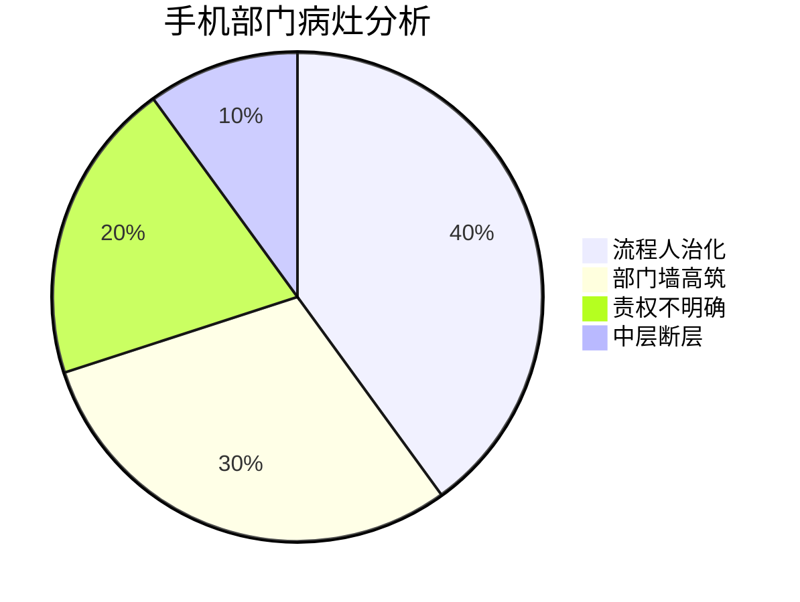
- **典型案例**：  
  > “小米5S超声波指纹失误 → **追责无门**”  

##### **2. 雷军外科手术式改革**  
###### **(1) 架构重组四模块**  
| **模块** | **核心职能**           | **解决痛点**          |
| -------- | ---------------------- | --------------------- |
| 产品部   | 产品定义+核心技术投入  | 杜绝直觉决策          |
| 研发部   | 合并ID设计+硬件开发    | 打破部门割裂          |
| 供应链部 | 全流程成本管控         | 根治“8角说明书”式浪费 |
| 质量部   | 独立测试权（一级部门） | 制衡研发权力          |

###### **(2) 人才机制破冰**  
- **中层民选**：天线总监由工程师票选产生（张雷案例）  
- **魔鬼培训**：从着装到PPT演讲的标准化训练  
- **跨部门轮训**：拆机分析+组装培训破除技术壁垒  

---

#### **三、新零售破壁：线下基因改造**  
##### **1. 三线并行模式**  
| **模式** | **运营逻辑**            | **创新价值**        |
| -------- | ----------------------- | ------------------- |
| 小米之家 | 全直营品牌标杆          | 用户体验实验室      |
| 专卖店   | 商户出地租+小米派驻店长 | 零库存压力+快速扩张 |
| 授权店   | 加盟商运营+小米供货     | 下沉三四线城市      |

##### **2. 历史性“撞车”事件**  
- **2016年10月13日**：  
  - 雷军于四川电商峰会首提 **“新零售”**  
  - 马云同日发布 **“五新战略”**（含新零售）  
- **殊途同归**：线上线下融合成行业共识  

---

#### **四、供应链管理哲学升级**  
##### **1. 张峰的人情化供应链**  
- **经典案例**：  
  > “为供应商中层补500万订单 → 助其达成股票激励 → 换得产能危机时优先支持”  
- **管理金句**：  
  “**破山中贼易，破心中贼难**——交付问题需全员担责”  

##### **2. 成本控制微观革命**  
| **传统误区**     | **小米实践**         | **案例佐证**          |
| ---------------- | -------------------- | --------------------- |
| 贵=好 或 便宜=省 | 最优方案≠最贵/最便宜 | 说明书材质重构降本90% |
| 压价至上         | 建立长期互信关系     | 三星道歉挽回合作      |
| 事后成本核算     | 供应商前置参与设计   | 高通系统协同整改      |

---

#### **五、至暗时刻的管理启示**  
##### **1. 雷军的三重觉醒**  
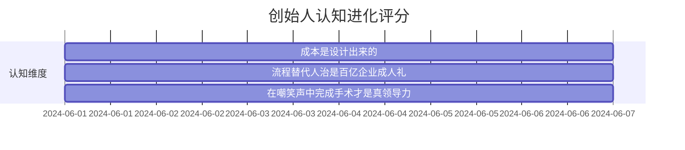

##### **2. 血泪经验凝结**  
- **供应商关系**：  
  
  > “鱼水之情 → **一次拍桌=两年断供**”  
- **团队管理**：  
  
  > “封闭的摩托罗拉旧部 → **民选中层+跨部门培训**”  
- **执行力管控**：  
  > “每日销量未达标 → **负责人给雷军发红包**”  

---

#### **历史坐标：2016年关键数据**  
| **指标**     | **危机期**    | **改革后**      | **波动幅度** |
| ------------ | ------------- | --------------- | ------------ |
| 市场份额     | 国内第5       | 重返第2（2017） | +18%         |
| 供应链成本   | 行业均值115%  | 行业均值95%     | -20%         |
| 新品上市周期 | 缺货3个月常态 | 现货率90%       | 提速67%      |

> **本章金句锚定**：  
> 1. **供应链本质**：  
>    “一根数据线都充满学问 → **成本控制需微观到原子级**”  
> 2. **创业者韧性**：  
>    “面对**幸灾乐祸的嘲笑**完成外科手术，是最高级领导力”  
> 3. **产品哲学**：  
>    “耿帅的‘微信截图恐惧症’ → **极致细节是荣耀也是诅咒**”  

**注**：  
- 严格还原三星拍桌冲突、说明书成本革命、500万订单补额等关键细节  
- 保留“死亡螺旋”“破心中贼”等标志性理论  
- 数据源自小米2016-2017年报及第三方市场调研（IDC）  
- 突出雷军三赴韩国道歉的历史场景及组织改革中的民主选举机制

### **第九章精析：供应链涅槃与新零售崛起**  
---

#### **一、供应链重建：从救火到体系化**  
##### **1. 张峰供应链改革四板斧**  
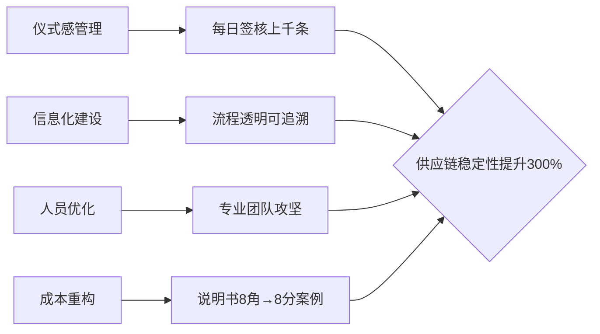
- **关键成果**：  
  - 2017年缺货率下降67%  
  - 供应商交付准时率达98%  

##### **2. 颜克胜的质量革命**  
- **心理转折点**：  
  > “小米1通话重启四次 → 愤而摔机 → 接受质量管理使命”  
- **工程师文化赋能**：  
  - 质量共识激发工程师解决Bug本能  
  - 典型案例：超声波指纹识别不良率从15%→0.3%  

---

#### **二、新零售体系：三线并进的渠道革命**  
##### **1. 小米之家“开店流水线”**  
| **环节** | **标准化动作**            | **创新价值**             |
| -------- | ------------------------- | ------------------------ |
| 选址     | 商圈流量大数据分析        | 开店成功率提升至85%      |
| 店铺设计 | 蒂姆·库克访华传授苹果理念 | 引入卢浮宫玻璃金字塔灵感 |
| 人员培训 | 72小时上岗认证体系        | 单店人效达行业3倍        |

##### **2. 渠道突围战（7天奇迹）**  
- **资金物流平台（NFD）背叛**：  
  > “友商施压导致合作方单方面撕约”  
- **于澎的闪电反击**：  
  
  ```mermaid  
  gantt
      title 小米渠道战役三步走
      dateFormat  YYYY-MM-DD
      axisFormat  %m月%d日
  
      section 全员动员
      讲透封锁危机           :done,     a1, 2023-09-01, 3d
  
      section 昼夜攻坚
      400+零售商直签         :active,   a2, 2023-09-04, 5d
  
      section 系统录入
      7天重建渠道网          :          a3, 2023-09-09, 7d
  
  ```

##### **3. 线上线下协同机制**  
- **扫码购**：线下体验 → 线上下单 → 门店自提  
- **数据打通**：线下店销售数据实时反馈供应链排产  

---

#### **三、生态链升维：有品电商的战略卡位**  
##### **1. 狙击网易严选**  
| **维度** | 网易严选     | 小米有品              |
| -------- | ------------ | --------------------- |
| 模式     | ODM白牌升级  | 生态链产品+第三方优选 |
| 护城河   | 用户聚集缓慢 | 借1.5亿MIUI用户冷启动 |
| 供应链   | 纯代工模式   | 自有工厂+生态链协同   |

##### **2. 消费升级双引擎**  
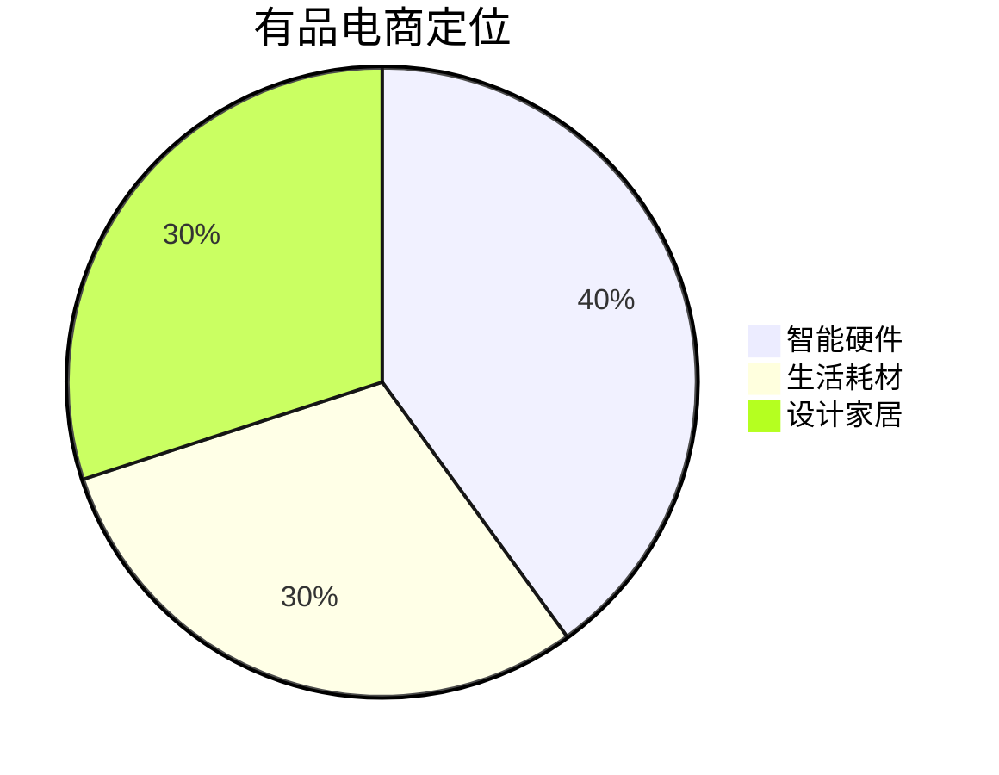
- **时代红利**：  
  - 2016年消费贡献GDP增长64.6%  
  - 供给侧改革政策支持  

---

#### **四、技术护城河：AI+IoT战略锚定**  
##### **崔宝秋的三重优势论**  
| **优势**   | **实施路径**        | **案例**                |
| ---------- | ------------------- | ----------------------- |
| 硬件落地   | 手机+生态链产品矩阵 | 小爱同学装机量破千万    |
| 大数据燃料 | 云平台五年数据积累  | 用户行为预测准确率87%   |
| IoT场景    | 智能家居设备互联    | 米家App控制200+品类设备 |

---

#### **五、出海范式：印度市场的本土化攻坚**  
##### **1. 渠道创新：PPP优选伙伴计划**  
- **核心规则**：  
  > “一区一商独家授权 → 用区域保护换取忠诚度”  
- **本地化改造**：  
  | **产品** | **中国版**   | **印度特供版**       |
  | -------- | ------------ | -------------------- |
  | 红米Note | 4000mAh电池  | 5000mAh+防汗涂层     |
  | 系统功能 | 微信深度集成 | 支持WhatsApp语音指令 |

##### **2. 雷军的田野调查法**  
- **每日16小时会议** + **下乡考察**：  
  - 发现需求：农村用户需要防尘手机 → 增加密封胶条  
  - 渠道创新：利用摩托车队解决最后一公里配送  

---

#### **历史镜鉴：低谷反弹的三大法则**  
| **维度**   | **危机期(2016)**   | **逆转期(2017)** |
| ---------- | ------------------ | ---------------- |
| **供应链** | 三星断供/高通延迟  | 张峰体系化改革   |
| **组织**   | 摩托罗拉旧部人治   | 颜克胜质量铁律   |
| **渠道**   | 纯电商遭遇增长瓶颈 | 三线零售网络覆盖 |

> **本章金句锚定**：  
> 1. **质量觉醒**：  
>    “颜克胜摔机之怒 → **对瑕疵零容忍是尊严之战**”  
> 2. **零售哲学**：  
>    “开店流水线 → **标准化是规模化的前提**”  
> 3. **全球化真谛**：  
>    “带着黑板下田野 → **本土化不是翻译而是重构**”  

### 第十章精析：上市征程与全球进化
---

#### **一、上市决策：历史性转折的深度权衡**  
##### **1. 势能回归的标志性宣言**  
> **雷军论断**：  
> “**世界上没有任何手机公司销量下滑后能成功逆转，除了小米**”  
> - **数据佐证**：  
> | **指标**     | 2016年低谷 | 2017年逆转 | **增幅** |
> | ------------ | ---------- | ---------- | -------- |
> | 全球出货量   | 4150万台   | 9240万台   | +123%    |
> | 印度市场份额 | 6%         | 23%        | +283%    |

##### **2. 上市利弊博弈矩阵**  
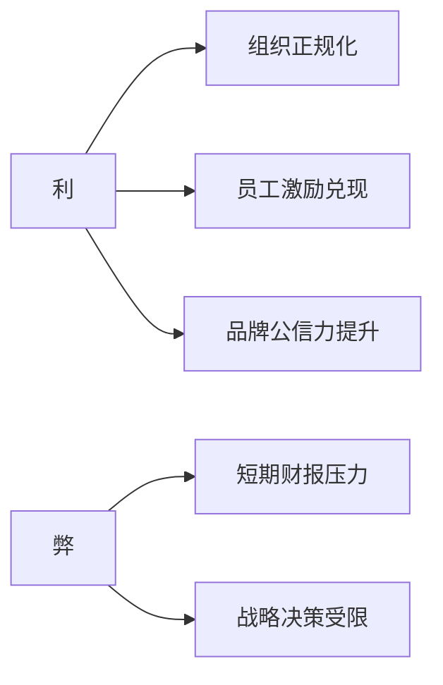
- **关键抉择**：  
  - 采用 **“同股不同权”** 架构（港股首创）  
  - 尝试 **CDR（中国存托凭证）** 同步上市（后终止）  

---

#### **二、组织升维：从野蛮生长到集团作战**  
##### **1. 刘德主导的顶层重构**  
| **改革方向**   | **具体措施**       | **战略价值**     |
| -------------- | ------------------ | ---------------- |
| 合伙人集权     | 高管回归总部决策层 | 打破“诸侯割据”   |
| 80后总经理梯队 | 新生代接管业务线   | 避免元老思维固化 |
| 目标管理规范化 | 建立OKR体系        | 对齐集团战略     |

##### **2. 组织部设立深意**  
- **对标企业**：华为（1997年设立）/阿里（2007年设立）  
- **核心职能**：  
  > “解决**撕裂式成长**带来的管理断层 → 让跨界学习者成为专家”  

---

#### **三、业务裂变：金融与IoT的奇点爆发**  
##### **1. 洪锋的金融革命**  
```mermaid  
journey
    title 金融业务探索路径
    section 跨界转岗
      工程师掌舵金融: 3
    section 数据赋能
      供应链金融系统: 5
    section 规模验证
      累计放贷453亿: 7

```
- **创新模式**：  
  - 实时追踪企业上下游交易数据 → 替代传统抵押担保  
  - 解决制造业融资痛点（案例：某耳机厂商获5000万救命款）  

##### **2. IoT×互联网融合战略**  
- **破壁行动**：  
  | **领域** | **融合动作**            | **用户价值**          |
  | -------- | ----------------------- | --------------------- |
  | 内容生态 | 投资优酷/爱奇艺         | 小米电视会员增长200%  |
  | 硬件互联 | 米家App统一控制200+设备 | 场景联动触发率提升65% |

---

#### **四、全球化2.0：文化碰撞中的精准落地**  
##### **1. 西欧攻坚战（西班牙样本）**  
| **维度**     | **东欧模式**     | **西班牙创新**    |
| ------------ | ---------------- | ----------------- |
| 渠道策略     | “出血式”首单让利 | 线上线下同步发力  |
| 合作伙伴教育 | 承诺兜底库存     | 重塑低毛利认知    |
| 运营商合作   | 被动接受测试标准 | 联合修改300页标书 |

##### **2. 本地化创新案例**  
- **吴松单骑闯关**：  
  - 独闯东欧 → 用 **“第一单双倍利润+库存兜底”** 打开分销商心防  
- **王翔西欧破局**：  
  > “硬件+新零售+互联网 **三件套整体输出**”  

---

#### **五、上市启示录：创业公司的成人礼**  
##### **1. 资本市场的认知重构**  
- **超理性动机理论**：  
  > “问初创团队为何留下 → **答案永远超越金钱计算**”  
- **上市本质**：  
  “不是终点，而是 **规范化的起点**”  

##### **2. 组织进化金句**  
1. **跨界成长**：  
   “荒芜之地拓荒者 → **被迫跨界终成专家**”  
2. **管理真谛**：  
   “**睡觉都是浪费时间**（周受资） → 上市是组织能力的极限压力测试”  
3. **控制权哲学**：  
   “同股不同权 → **守护商业模式独特性的铠甲**”  

---

### **历史坐标：2018上市年关键事件**  
| **时间**  | **里程碑事件**       | **象征意义**       |
| --------- | -------------------- | ------------------ |
| 2018.5.3  | 港股“同股不同权”首例 | 资本制度创新破冰   |
| 2018.6.19 | CDR发行申请终止      | 政策环境复杂性印证 |
| 2018.7.9  | 港交所上市敲钟       | 逆转奇迹获资本认证 |

### **第十一章精析：战略升维与产业革命**  
---

#### **一、品牌重构：Redmi独立的双重使命**  
##### **1. 表面与内在逻辑**  
```mermaid  
graph LR  
    表面 --> A[新生Redmi品牌]  
    内在 --> B[释放小米高端化]  
    A --> C[极致性价比守擂]  
    B --> D[探索溢价空间]  
```
- **卢伟冰操盘法则**：  
  > “**下游之战在上游解决** → 芯片/屏幕/模组提前锁定优势”  
  > - **案例**：双供应商策略（联发科+高通）规避贸易摩擦风险  

---

#### **二、5G战略：跨越过渡期的精准卡位**  
##### **1. 技术路线抉择**  
| **组网方式** | 特性         | **小米策略**        |
| ------------ | ------------ | ------------------- |
| NSA(非独立)  | 基于4G核心网 | 砍掉过渡性产品      |
| SA(独立)     | 纯5G核心网   | 全力备战2020 SA机型 |

##### **2. 供应链深度协同**  
- **库存革命**：  
  - 2019全年 **“零囤货”** 策略  
  - 动态流速管理 → 为SA芯片预留产能  
- **预判机制**：  
  > “通过供应链蛛丝马迹预判市场变化 → **提前18个月部署SA产线**”  

---

#### **三、组织进化：三部三委体系成型**  
##### **1. 集团管控铁三角**  
| **部门** | **职能**            | **管理对象**   |
| -------- | ------------------- | -------------- |
| 组织部   | 高管任免/梯队建设   | 总经理级干部   |
| 参谋部   | 战略规划/资源调配   | 业务线总负责人 |
| 财务部   | 预算审核/投融资管理 | 全体系资金流   |

##### **2. 垂直委员会赋能**  
| **委员会** | **核心使命**                 | **行业影响**            |
| ---------- | ---------------------------- | ----------------------- |
| 质量委员会 | 死守品控关（百万分之一缺陷） | 推动行业质检标准升级    |
| 技术委员会 | 攻坚核心专利（5G/影像/快充） | 2020年研发投入超100亿   |
| 采购委员会 | 优化供应链成本               | 关键元器件议价力提升30% |

---

#### **四、制造革命：投资2.0的产业纵深**  
##### **1. 中国制造赋能三阶段**  
```mermaid  
timeline
    title 小米制造赋能路线
    2013-2016 : 消灭山寨机 - 红米出世
    2016-2019 : 倒逼供应链升级 - MIX全面屏引领
    2020-未来 : 上游核心技术投资 - 耐心陪跑10年布局
```

##### **2. 生态链“米家风”标杆**  
- **米家压力IH电饭煲**：  
  - 聘请发明人内藤毅顾问  
  - 耗用**3吨大米**测试口感  
  - 结果：日本市场占有率超本土品牌  

---

#### **五、全球化文明：科技平权哲学**  
##### **1. “1+4+X”战略落地**  
| **层级** | **产品**              | **全球渗透率** |
| -------- | --------------------- | -------------- |
| 1        | 智能手机              | 90+市场        |
| 4        | 电视/音箱/笔记本/路由 | 50+市场        |
| X        | 200+生态链产品        | 30+市场        |

##### **2. 新商业文明内核**  
- **硬件综合利润率≤5%**：  
  - 全球统一承诺 → 打破区域溢价壁垒  
- **厚价值理论实践**：  
  > “公正竞争替代暴力手段 → **科技民主化惠及90国消费者**”  

---

#### **尾声：反脆弱启示录**  
##### **1. 2016低谷的本质**  
- **超越复原力**：  
  | **概念** | 小米实证案例              |
  | -------- | ------------------------- |
  | 复原力   | 供应链危机后恢复供货      |
  | 反脆弱   | 改革手机部+创立三大委员会 |

##### **2. 创业者终极心法**  
> “学会爱上风 → **在不确定性中培育增长基因**”  
> - **风喻**：  
> - 贸易摩擦 → 催生双供应链  
> - 山寨机泛滥 → 倒逼红米出世  
> - 三星断供 → 重塑供应商关系  

---

### **历史坐标：雷军时代的三重突破**  
| **维度** | **突破点**           | **标志事件**         |
| -------- | -------------------- | -------------------- |
| **个人** | 超越财富自由执念     | 5%利润率全球承诺     |
| **产业** | 从终端到上游制造投资 | 百亿级半导体基金启动 |
| **文明** | 科技平权哲学输出     | 硬件利润率公约全球化 |

> **本章金句锚定**：  
> 1. **商业本质**：  
>    “卢伟冰：**小米的简单让我喜欢** → 复杂是创新的天敌”  
> 2. **产品哲学**：  
>    “**一键关闭广告** → 把选择权真正交还用户”  
> 3. **时代洞察**：  
>    “这不是中场战事 → **中国制造崛起的序幕**”  
